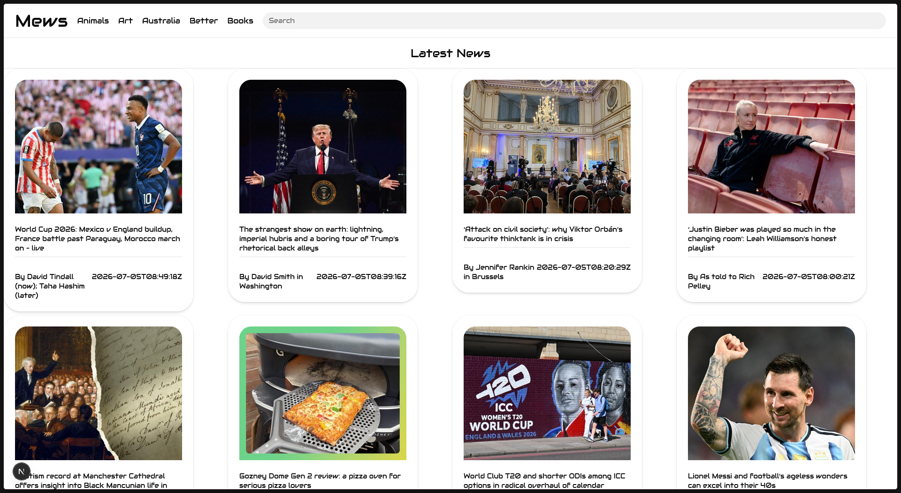
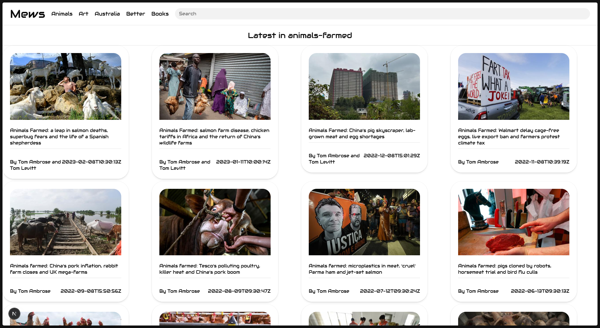
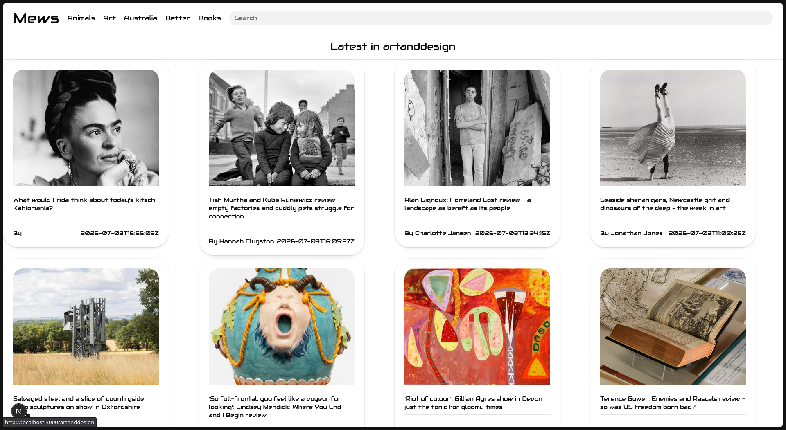
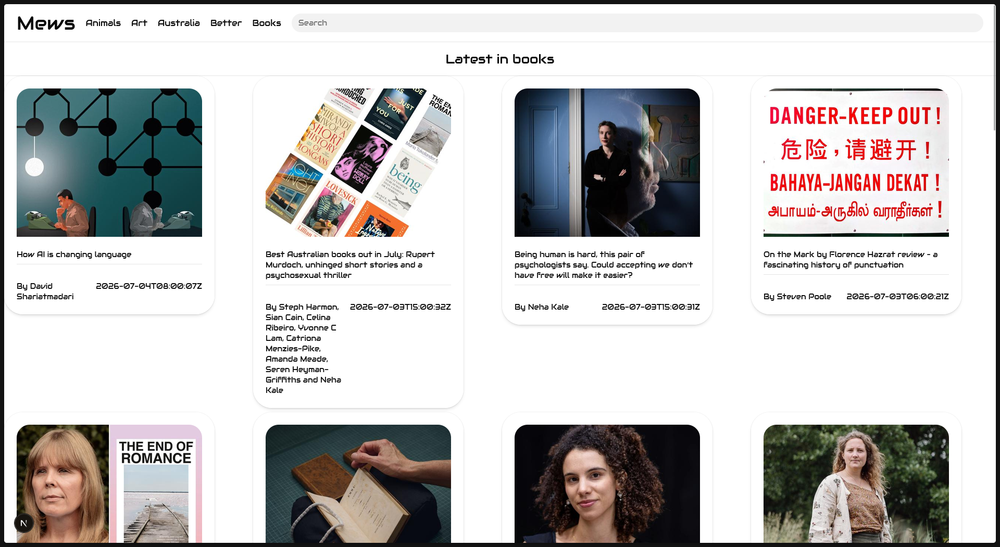
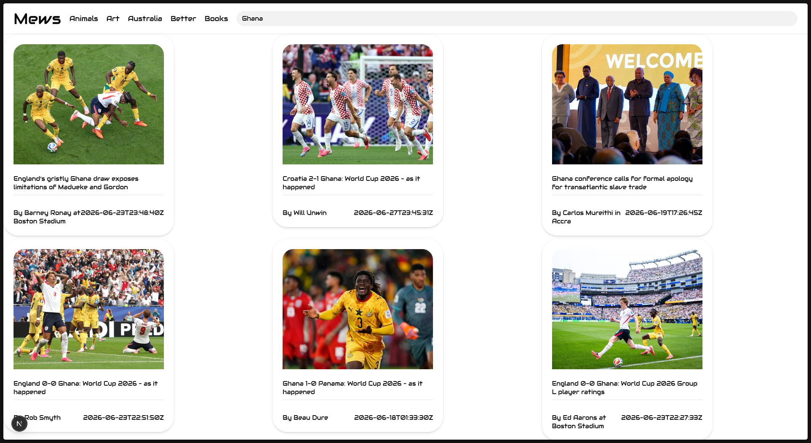

# [Mews](https://mews.com)

Mews is a website -- how do I describe -- Well, please see for yourself

# Pages

## Sections

The sections are gotten from the api and displayed in the navbar

## Search

The search works by fetching from the api, news articles that contain the phrase or something similar

# Reasoning

Well I did this for hackclub of course

I know there are a few bugs but it seems for the life of me I can't fix them. But at least it does fetch the news.

